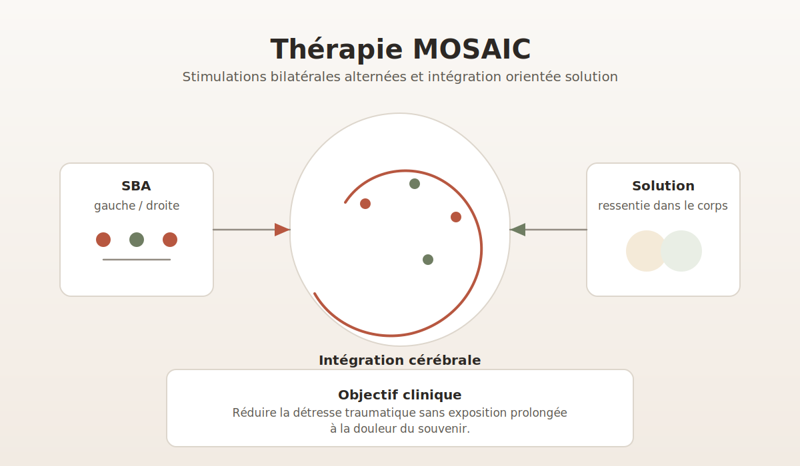
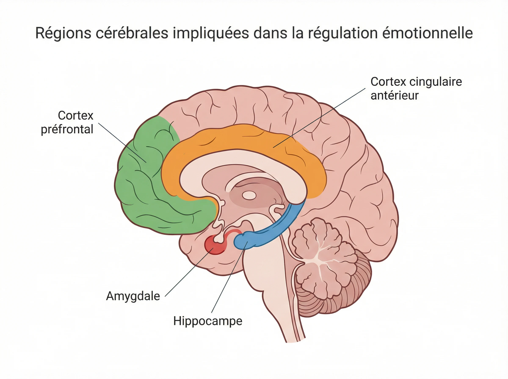

---
title: "Thérapie MOSAIC à Sceaux : trauma et apaisement"
description: "Psychologue à Sceaux, j'utilise la thérapie MOSAIC pour accompagner les difficultés liées aux mémoires douloureuses, aux émotions fortes et au stress."
pubDate: "2026-02-21"
heroImage: '../../assets/blog/emdr-mosaic.webp'
---
 
La thérapie **MOSAIC** (*Mouvements Oculaires et Stimulations Alternées pour l'Intégration Cérébrale*) est une approche de psychothérapie brève créée en **2019**. Elle utilise les **stimulations bilatérales alternées** (mouvements oculaires, sons alternés, stimulations tactiles), comme dans l'EMDR, avec une logique orientée vers les solutions.

Si vous cherchez une aide pour un traumatisme, l'objectif de MOSAIC est clair : **apaiser la détresse sans vous replonger longuement dans la douleur du souvenir**.

*Illustration : modèle simplifié du fonctionnement de la thérapie MOSAIC.*

## Thérapie MOSAIC à Sceaux : pour quelles difficultés ?

Dans le cadre de la **thérapie MOSAIC**, je propose un accompagnement pour des difficultés liées à :

- Des mémoires douloureuses ou traumatiques,
- Des situations provoquant des émotions fortes,
- Un stress persistant après un événement difficile.

L'indication se décide toujours lors d'une évaluation clinique individuelle.

## MOSAIC : définition simple

La thérapie MOSAIC vise à activer des ressources déjà présentes chez la personne, notamment à travers des **sensations corporelles de sécurité, d'apaisement ou de force**.

Au lieu de rester centrée sur le problème et son historique, la méthode travaille surtout sur :

- Ce qui aide déjà, même partiellement,
- Ce que vous souhaitez ressentir à la place,
- Comment stabiliser ce nouvel état dans la vie quotidienne.

## Différence entre l'EMDR et MOSAIC

L'EMDR et MOSAIC partagent l'usage des SBA. La différence principale est le point d'entrée thérapeutique :

- L'EMDR travaille classiquement avec le souvenir traumatique cible,
- **MOSAIC** met davantage l'accent sur l'expérience corporelle de la solution.

En pratique, de nombreuses personnes décrivent MOSAIC comme une approche plus douce, tout en restant active et structurée.

## Comment se passe une séance MOSAIC ?

Le protocole de référence est décrit en **4 étapes** :

1. **Entretien MOSAIC**  
Définition de la situation limitante, des objectifs, et d'une sensation interne désirée (DIS).

2. **Boucle de reconnexion**  
Renforcement de la DIS avec SBA, puis reconnexion progressive à la situation difficile jusqu'à un ressenti suffisamment confortable.

3. **Projection des bénéfices**  
Travail sur les changements concrets attendus dans votre quotidien, toujours en appui sur le ressenti corporel.

4. **Debriefing et tâche sensorielle**  
Intégration de la séance et exercice simple entre les séances pour stabiliser le travail.

## Ce que disent les neurosciences

Les recherches sur le psychotraumatisme et l'EMDR montrent l'implication de réseaux cérébraux liés :

- À la peur et la menace (amygdale),
- À la mémoire contextuelle (hippocampe),
- À la régulation émotionnelle (cortex préfrontal),
- À la conscience de soi et l'intégration multisensorielle (insula, précuneus, cingulaire).

Les SBA semblent moduler ces réseaux et favoriser une reconsolidation de la mémoire traumatique avec moins de charge émotionnelle.

*Illustration : principales régions cérébrales impliquées dans la régulation émotionnelle.*

## Efficacité : ce qu'on peut dire avec rigueur

- L'EMDR est une thérapie validée scientifiquement pour le TSPT.
- MOSAIC repose sur des bases cliniques et neurophysiologiques solides et montre déjà des résultats très prometteurs dans la prise en charge du psychotraumatisme.

## Pourquoi des patients choisissent MOSAIC

Les motifs fréquents sont :

- Vouloir une approche active sans exposition prolongée à la douleur,
- Retrouver un sentiment de sécurité intérieure,
- Avancer à un rythme respectueux, avec des outils concrets entre les séances.

## FAQ

### La thérapie MOSAIC est-elle reconnue ?
MOSAIC est enseignée et pratiquée par des professionnels formés. Comme toute méthode récente, son niveau de preuve continue d'évoluer avec la recherche.

### Combien de séances faut-il ?
Cela dépend de la nature du trauma, de son ancienneté, de vos ressources actuelles et de votre situation globale. L'évaluation initiale permet d'estimer un cadre.

### Peut-on faire MOSAIC si on a déjà suivi une thérapie EMDR ?
Oui, c'est possible. Les deux approches peuvent être complémentaires selon vos besoins.
## Mon cadre actuel d'accompagnement en thérapie MOSAIC

Je me forme actuellement à la **thérapie MOSAIC de référence** :  
[Formation MOSAIC de référence](https://www.therapiemosaic.com/formations/mosaic-de-reference-1759841379915)

Cette formation me permet d'appliquer le protocole de référence pour accompagner les mémoires douloureuses, les situations émotionnellement intenses et le stress, en m'appuyant sur les bases neurophysiologiques et psychologiques de la thérapie MOSAIC.

Cette formation de référence ouvre ensuite vers des spécialisations :

- Traumatisme complexe,
- Dépression,
- Troubles anxieux (trouble anxieux généralisé, trouble panique, phobie),
- TOC,
- Addiction / TCA,
- Bébés / Enfants / Adolescents,
- Couple.

## Consultation MOSAIC à Sceaux (92) et en visio

Je vous reçois au cabinet à **Sceaux** et propose aussi des **consultations en visioconsultation** selon la situation.

Pour préparer votre démarche :

- Voir les [psychothérapies proposées](/psychotherapie/),
- Lire aussi : [Pourquoi consulter un psychologue ?](/blog/pourquoi-consulter-psychologue/),
- Réserver un créneau via Doctolib

Le cabinet est accessible pour les personnes habitant Sceaux et les villes voisines (Antony, Bourg-la-Reine, Châtenay-Malabry, Fontenay-aux-Roses, Le Plessis-Robinson).

## Pour aller plus loin

- Site officiel : [therapiemosaic.com](https://therapiemosaic.com)
- Annuaire des praticiens formés : disponible sur le site officiel
- Article : Khalfa S., Poupard G. *MOSAIC: A New Pain-Free Psychotherapy for Psychological Trauma* (Am J Psychother)

